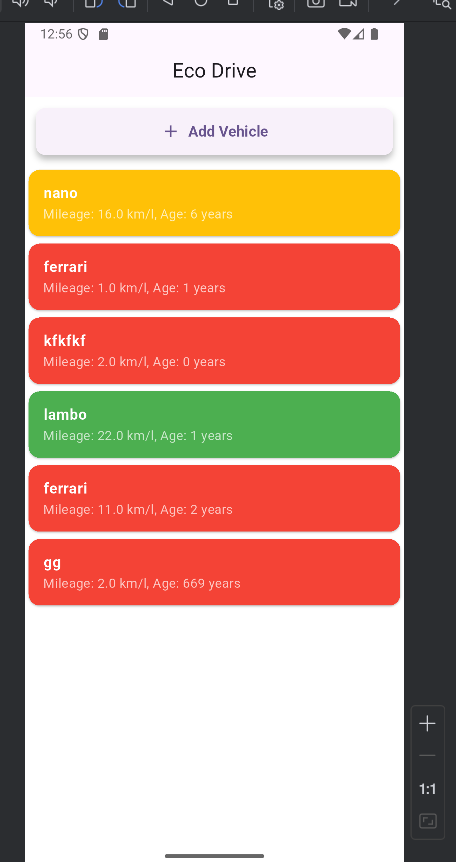

# vehicle_eco

A new Flutter project.

## Getting Started

A few resources to get you started if this is your first Flutter project:

- [Lab: Write your first Flutter app](https://docs.flutter.dev/get-started/codelab)
- [Cookbook: Useful Flutter samples](https://docs.flutter.dev/cookbook)

For help getting started with Flutter development, view the
[online documentation](https://docs.flutter.dev/), which offers tutorials,
samples, guidance on mobile development, and a full API reference.

## Screenshots

Here are some screenshots of the app:

## Drive Link

You can find additional resources or APK builds in this Google Drive folder:  
[Google Drive Link](https://drive.google.com/file/d/1WfRGrUcqAWpXfQ8QCOQqhnQC7jZ2_Q40/view?usp=sharing)
